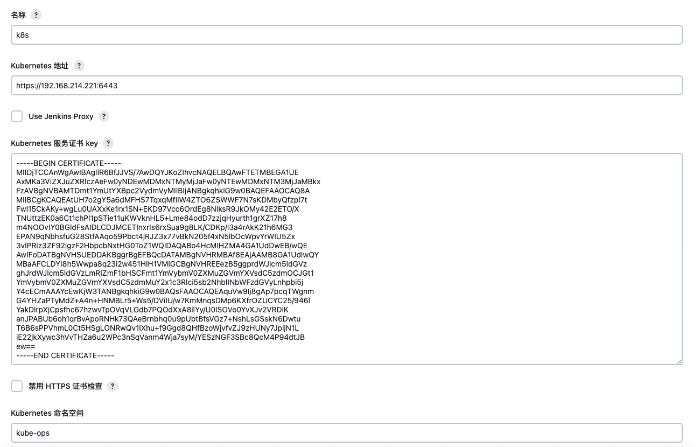
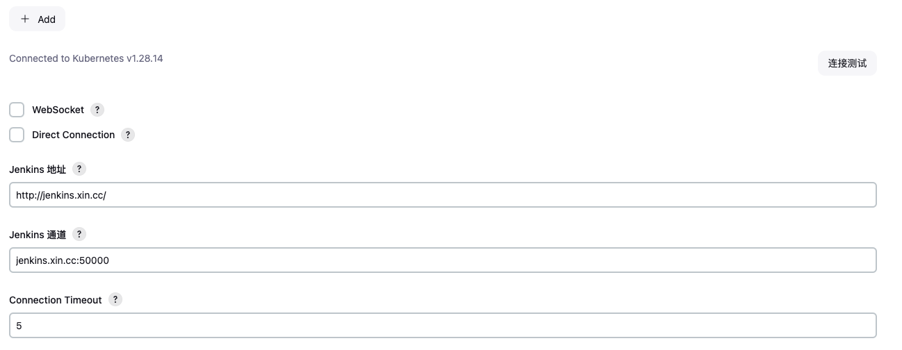
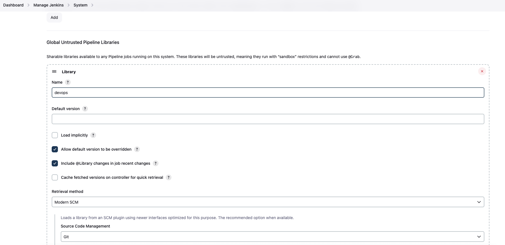
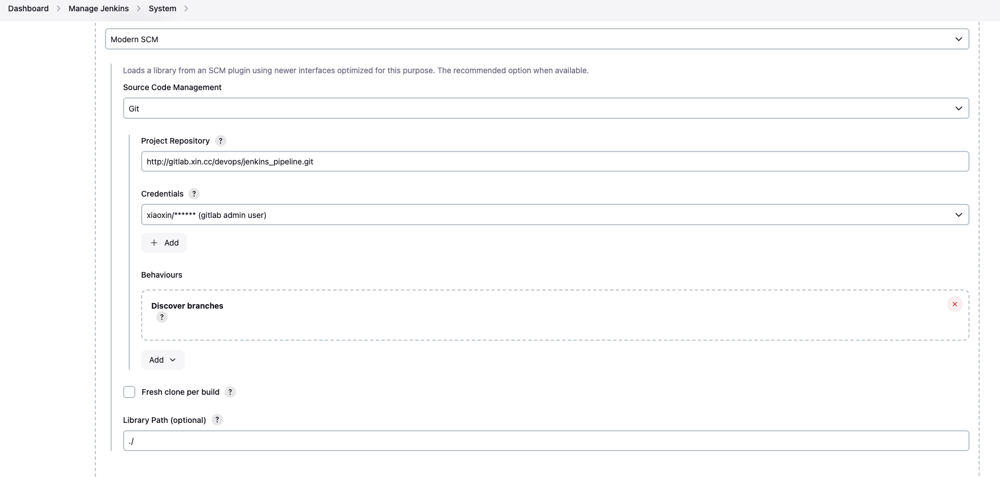

#### jenkins 共享库
这个项目主要用于k8s中的jenkins构建

##### 依赖插件
- pipeline
- Kubernetes CLI
- Git Parameter

#### 创建configmap、volume、serviceAccount
```shell
kubectl create -n kube-ops     # 创建jenkins专用命名空间
kubectl apply -f resource/config/serviceAccount.yaml -f resource/config/configmap.yaml -f resource/config/volume.yaml
```
- configmap 主要是配置docker相关的配置
- volume 配置jenkins_home目录
- serviceAccount jenkins运行时候的账号

#### 配置gitlab、harbor、k8s认账使用的配置(Credentials)
- gitlab、harbr使用username/password类型
- k8s 需要使用Secret text, 里面写token，token通过 `kubectl  describe Secret -n kube-ops jenkins`获取

#### 然后配置jenkins
##### 添加kubernetes



##### 共享库配置




####  gitlab仓库
- example/code 是测试代码仓库，在gitlab中创建一个仓库，把文件放入
- example/deploy 是部署仓库使用`kustomize`
- example/deploy/http-test/docker 是docker构建目录，dockerfile.general是通用构建文件，后面加上后缀表示不同的环境，这个跟jenkinsfile环境配置需要保持一致, 如果找不到则使用默认的文件进行构建


#### jenkins创建一个流水线
名称是 `{项目名称}-{部署区域}` 比如 `http-test-beijing`

